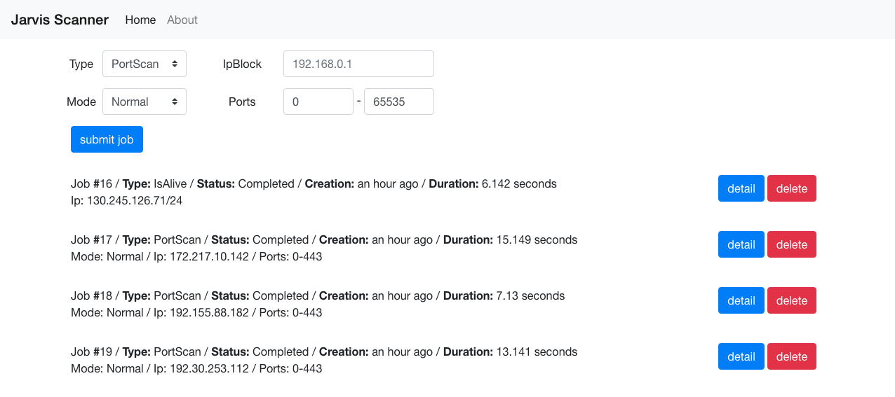
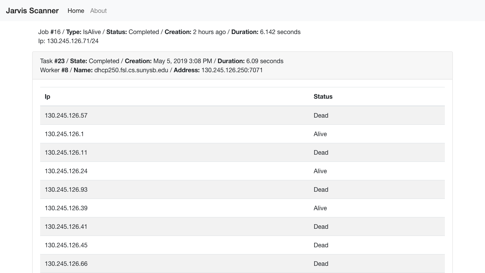

## Jarvis Scanner


**Home screen** - *list all jobs*



**Detail screen** - *list workers, tasks and its output*

### Setup

```bash
  # Add your public key to Github
  # install golang 1.12
  # https://github.com/golang/go/wiki/Ubuntu
  # Setup $GOPATH
  # Clone the repository
  mkdir -p $GOPATH/src/github.com/iakshay/jarvis-scanner
  git clone git@github.com:iakshay/jarvis-scanner.git $GOPATH/src/github.com/iakshay/jarvis-scanner

  # Install dependencies
  
  # golang orm
  go get -u github.com/jinzhu/gorm

  # sqlite3 driver
  go get -u github.com/mattn/go-sqlite3

  # network packet related
  go get -u golang.org/x/net/ipv6
  go get -u golang.org/x/net/ipv4
  go get -u golang.org/x/net/icmp
  go get -u github.com/google/gopacket

  # testing
  go get -u github.com/stretchr/testify

  # generate strings
  # optional: used to generate strings.go
  go get -u golang.org/x/tools/cmd/stringer

  # Running worker ($GOPATH/bin/worker)
  # need root privilege for listening on network device and sending icmp packets
  # change serverAddr and workerAddr for multiple machine or vm setup
  sudo go run cmd/worker/worker.go --serverAddr="127.0.0.1:8001" --workerAddr="127.0.0.1:7071"

  ## To run the server, build the ui first
  # install nodejs and npm
  cd ui/
  # install dependencies
  npm install
  # build the ui
  npm run build
  
  # Running server ($GOPATH/bin/server) 
  # note: clean flag will delete existing database
  go run cmd/server/server.go --serverAddr="0.0.0.0:8000" --clean

  ## Running Command-line Client

  # Building client
  cd cmd/client
  go build client.go
 
  # Sample usage of Command-line Client
  # For list jobs
  ./client -task=list

  # For view specific job
  ./client -task=view -id=1

  # For delete job
  ./client -task=delete -id=1

  # For submit IsAlive Job
  ./client -task=submit -type=IsAlive -ip=192.168.2.1/24

  # For submit PortScan Job
  ./client -task=submit -type=PortScan -ip=69.63.176.0 -mode=Normal -start=0 -end=443
  
  ## Testing
  # Setup 2 VM's to run tests
  # install virtualbox and vagrant
  # start the vms, refer Vagrantfile
  vagrant up
  
  # login to server vm
  vagrant ssh server
  # start listening on tcp ports 7000 and 8000
  nc -l 7000 &
  nc -l 8000 &
  
  # login to client vm
  vagrant ssh client
  sudo go test

```
 
## Examples

IsAlive w/ IpBlock

```js
// POST /jobs
{
 "Type": 0,
 "Data": {
  "IpBlock": "192.168.2.1/24"
 }
}
```
IsAlive w/ Ip

```js
// POST /jobs
{
 "Type": 0,
 "Data": {
  "IpBlock": "192.168.2.1"
 }
}
```

PortScan

```js
// POST /jobs
{
 "Type": 1,
 "Data": {
  "Type": 1,
  "Ip": "127.0.0.1",
   "PortRange": {
   "Start": 0,
   "End": 65535
   }
 }
}
```
